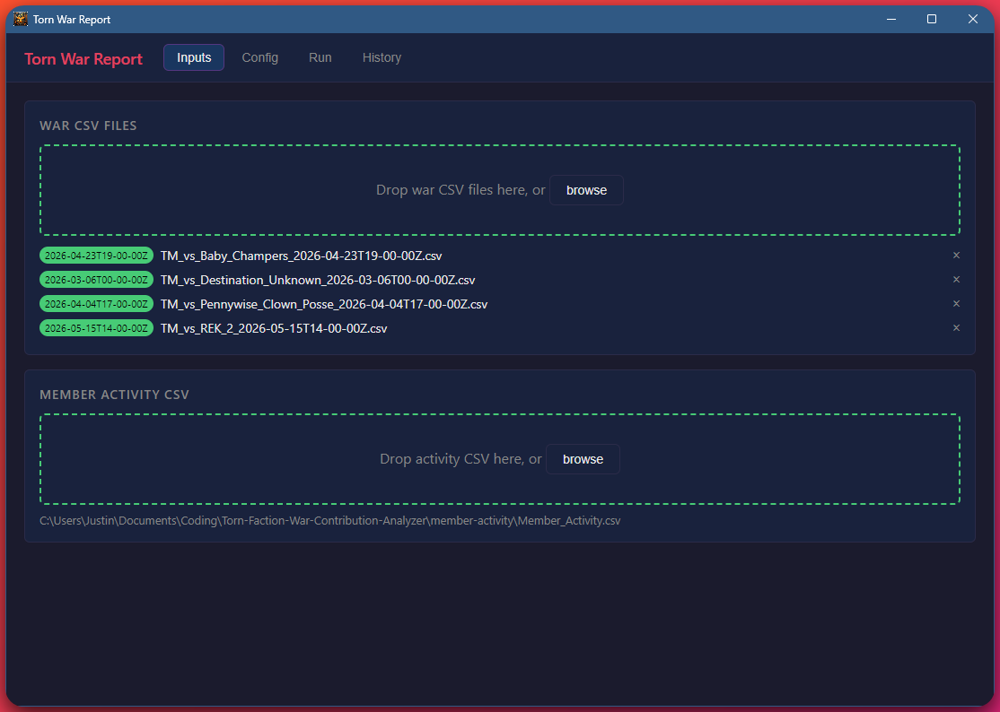
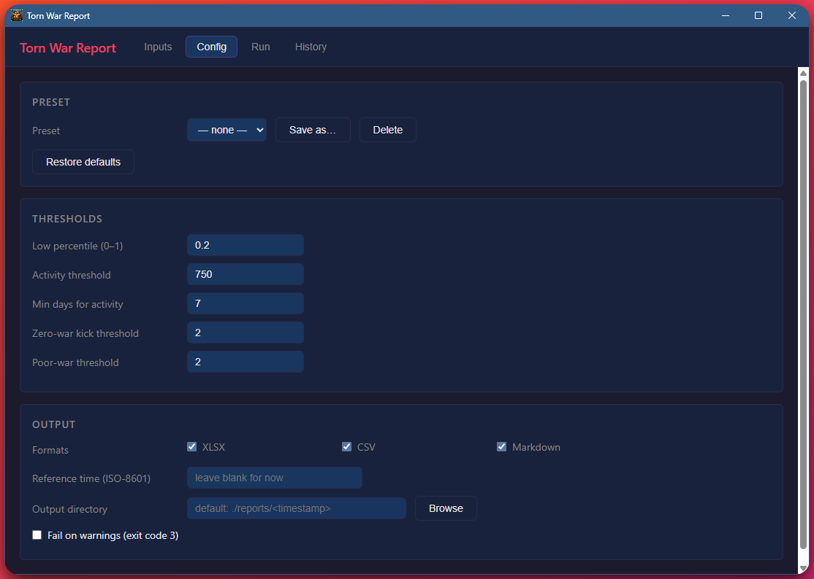

# Torn Faction War Contribution Analyzer

Identify which faction members are underperforming in ranked wars and/or have low overall activity. Drop in your Torn CSV exports, click Run, and get a full report — no terminal required.

---

## Desktop GUI (recommended)

The easiest way to use this tool is the **Torn War Report** desktop app. It wraps the full analysis engine in a point-and-click interface.




### Download

Download the latest installer from the [Releases](../../releases/latest) page:

| Platform    | File to download                                              |
| ----------- | ------------------------------------------------------------- |
| **Windows** | `torn-war-report-vX.X.X-setup.exe` (NSIS installer) or `.msi` |
| **macOS**   | `torn-war-report_vX.X.X_x64.dmg`                              |
| **Linux**   | `torn-war-report_vX.X.X_amd64.AppImage`                       |

> **macOS note:** builds are unsigned. On first launch, right-click the app → **Open** to bypass the Gatekeeper warning.

### Using the GUI

**Inputs tab** — Load your files:

- Drag and drop war CSV files (or use the Browse button). Each file is validated — a green badge confirms the date was parsed from the filename, red means the filename is missing an ISO-8601 date.
- Drag or browse to your `Member_Activity.csv`. One slot, one file.

**Config tab** — Tune the analysis:

- Adjust thresholds (low percentile, activity cutoff, kick thresholds, output formats).
- Save your settings as a named preset and reload them next session.
- "Restore defaults" resets everything to the shipped defaults.

**Run tab** — Execute the analysis:

- Click **Run Analysis** to run the full analysis and write reports, or **Validate Only** to check your files without writing output.
- A progress bar tracks each pipeline stage. Any parse warnings appear as a chip you can expand.
- When the run finishes, click **Open folder** to browse the output files, or **Open summary.md** to read the human-readable summary directly.

**History tab** — Browse past runs:

- Every completed analysis writes a `run.json` manifest into its output folder. The History tab reads these to list all past runs.
- Click **Re-run** on any row to reload the exact same files and config into the Inputs and Config tabs.

---

## CLI

Power users and server-side automation can use the `torn-war-report` CLI directly.

### Quick start

```
# Build the release binary
cargo build --release

# Run a full analysis
./target/release/torn-war-report analyze \
  --wars ./path/to/war/csvs \
  --activity ./Member_Activity.csv

# Dry-run: validate inputs without writing any output
./target/release/torn-war-report validate \
  --wars ./path/to/war/csvs \
  --activity ./Member_Activity.csv
```

Reports are written to `./reports/<UTC_timestamp>/` by default.

### Building

Requires Rust 1.75+ (stable). No system dependencies beyond the Rust toolchain.

```
cargo build             # debug build
cargo build --release   # optimized release build
cargo test              # run all tests
```

### Commands

#### `analyze` — run a full analysis and write reports

```
torn-war-report analyze [OPTIONS]

Required:
  --wars <PATH>          Directory, glob pattern, or individual file. Repeatable.
  --activity <PATH>      Member Activity CSV path.

Optional:
  --output <DIR>         Output directory. Default: ./reports/<timestamp>/
  --formats <LIST>       Comma-separated: xlsx,csv,markdown. Default: all three.
  --reference-time <ISO8601>  Override "now" for tenure calculation.
  --low-percentile <0..1>
  --activity-threshold <FLOAT>
  --min-days <INT>
  --zero-war-kick-threshold <INT>
  --poor-war-threshold <INT>
  --fail-on-warnings     Exit code 3 if any warnings were emitted.
  --emit <text|json>     Output format: human-readable text (default) or NDJSON events.
```

Examples:

```
# Analyze wars in a directory, all three output formats
torn-war-report analyze \
  --wars ./wars \
  --activity ./Member_Activity.csv

# Only produce the Excel workbook
torn-war-report analyze \
  --wars ./wars \
  --activity ./Member_Activity.csv \
  --formats xlsx

# Use a stricter low-percentile cutoff and lower activity threshold
torn-war-report analyze \
  --wars ./wars \
  --activity ./Member_Activity.csv \
  --low-percentile 0.30 \
  --activity-threshold 600

# Emit structured NDJSON events for programmatic consumption
torn-war-report --emit=json analyze \
  --wars ./wars \
  --activity ./Member_Activity.csv
```

#### `validate` — parse inputs without writing output

Useful for checking that your CSVs are well-formed and filenames are correct before committing to a full run.

```
torn-war-report validate --wars ./wars --activity ./Member_Activity.csv
```

Exits 0 on success. Exits 1 on parse errors. Prints any warnings to stderr.

#### `schema` — print expected CSV column layouts

```
torn-war-report schema
```

### JSON output mode (`--emit=json`)

Pass `--emit=json` before the subcommand to switch stdout from human-readable text to **newline-delimited JSON (NDJSON)**. Each line is one event. This is how the GUI communicates with the CLI internally, and it's stable for any other programmatic consumer.

```
{"type":"start","subcommand":"analyze","config":{...},"reference_time":"..."}
{"type":"progress","stage":"expand_wars","detail":"matched 4 files"}
{"type":"progress","stage":"parse_war","current":1,"total":4,"file":"..."}
{"type":"progress","stage":"parse_activity","file":"..."}
{"type":"progress","stage":"analyze"}
{"type":"warning","kind":"MalformedRow","source":"...","context":"row 17","message":"..."}
{"type":"progress","stage":"write","format":"xlsx","path":"..."}
{"type":"done","exit_code":0,"output_dir":"...","outputs":{...},"warning_count":1,"list_sizes":{...}}
```

Every completed run also writes a `run.json` manifest into its output directory with the same payload as the `done` event plus a full input file list and resolved config.

---

## Input files

### War CSVs

One file per ranked war, exported directly from Torn. The **filename must embed the war's UTC start time** in this format:

```
<anything>_<YYYY-MM-DDTHH-MM-SSZ>.csv
```

Colons are replaced with dashes in the time portion because Windows filenames don't allow colons. Examples:

```
TM_vs_REK_2_2026-05-15T14-00-00Z.csv
TM_vs_Baby_Champers_2026-04-23T19-00-00Z.csv
War_2026-03-06T00-00-00Z.csv
```

Required columns (case-sensitive): `attacker_name`, `attacker_id`, `Hits`, `WarHits`, `Points`

The actual Torn export column order is:

```
attacker_name, attacker_id, Hits, WarHits, NotWarHits, Assist, Retals,
Overseas, BonusHits, AvgFF, Extra, Points, Value, ...
```

Trailing blank rows and right-hand summary cells (Total Pool, Expenses, etc.) that Torn appends to the export are handled automatically.

### Member Activity CSV

A single file exported from your faction activity tracker. Default expected name is `Member_Activity.csv` but any path works.

Required columns: `Name`, `Days`, `avgE30`

The actual column order from the Torn faction activity export:

```
Name, Days, Donator?, Property, avgE7, avgE30, gym30, gym7, attacks7,
attacks30, Xanax Daily, act30, act7, Revs Last 30, Contract Last 30, Revive Skill
```

The second row is a blank separator row — this is expected and skipped automatically.

Run `torn-war-report schema` (or check the **Schema** section in the GUI) to print the full expected column layout for both file types.

---

## How the analysis works

1. **War presence** — For each member, their `Days` value is compared against how long ago the war was fought. A member is considered present only if `Days > days_ago` (strict). Members who joined too recently are marked `Excluded` for that war.

2. **Low threshold** — For each war independently, the 20th percentile of points scored by present, non-zero participants is computed (linear interpolation). This is the `Low` cutoff.

3. **Per-war classification** — Each (member, war) pair is classified as:
   - `Excluded` — not in faction yet
   - `Zero` — present but 0 points
   - `Low` — present, scored ≤ the low threshold
   - `Ok` — present, scored above the threshold

4. **Lists generated:**
   - **Auto-Kick** — 2+ zero-point wars
   - **Repeat Offenders** — 2+ poor wars (zero + low combined)
   - **Any Single Bad War** — at least one Zero or Low war
   - **Low Activity** — `Days ≥ 7` and `avgE30 < 750`
   - **Combined Kick List** — on both Repeat Offenders and Low Activity

All thresholds are configurable (see Configuration below).

---

## Output files

All files are written to the output directory (`./reports/<timestamp>/` by default).

| File                   | Format   | Description                                                   |
| ---------------------- | -------- | ------------------------------------------------------------- |
| `analysis.xlsx`        | XLSX     | Multi-sheet workbook with all lists, war matrix, and warnings |
| `auto_kick.csv`        | CSV      | Members with 2+ zero-point wars                               |
| `repeat_offenders.csv` | CSV      | Members with 2+ poor wars                                     |
| `any_bad_war.csv`      | CSV      | Members with at least one Zero or Low war                     |
| `low_activity.csv`     | CSV      | Members below the avgE30 threshold                            |
| `combined_kick.csv`    | CSV      | Intersection of Repeat Offenders and Low Activity             |
| `war_matrix.csv`       | CSV      | Every member × every war, with points and hits                |
| `warnings.csv`         | CSV      | Parse/analysis warnings, if any                               |
| `summary.md`           | Markdown | Human-readable summary of all lists and warnings              |
| `run.json`             | JSON     | Machine-readable manifest of the run (used by History tab)    |

The XLSX workbook has one sheet per list plus an Overview sheet and a War Matrix sheet. Zero-point war cells are highlighted red; low-point war cells are highlighted yellow.

---

## Configuration

### Config file

Create a `torn-war-report.toml` in the directory you run the tool from (or pass `--config <path>`):

```toml
[analysis]
low_percentile = 0.20          # bottom-N% cutoff for "Low" classification
min_days_for_activity = 7      # minimum tenure to evaluate avgE30
activity_threshold = 750.0     # avgE30 below this = low activity
zero_war_kick_threshold = 2    # zero-point wars before auto-kick
poor_war_threshold = 2         # total poor wars before repeat-offender flag

[output]
formats = ["xlsx", "csv", "markdown"]
```

The GUI's Config tab exposes all of these as form fields. Presets are saved to `%APPDATA%\com.justinv.torn-war-report\presets.json`.

### Config resolution order (lowest → highest priority)

1. Bundled defaults (compiled into the binary)
2. Config file: `--config <path>`, or auto-discovered at `./torn-war-report.toml`
3. Environment variables with `TWR_` prefix (e.g. `TWR_LOW_PERCENTILE=0.15`)
4. CLI flags

### Environment variables

| Variable                      | Config key                         |
| ----------------------------- | ---------------------------------- |
| `TWR_LOW_PERCENTILE`          | `analysis.low_percentile`          |
| `TWR_ACTIVITY_THRESHOLD`      | `analysis.activity_threshold`      |
| `TWR_MIN_DAYS`                | `analysis.min_days_for_activity`   |
| `TWR_ZERO_WAR_KICK_THRESHOLD` | `analysis.zero_war_kick_threshold` |
| `TWR_POOR_WAR_THRESHOLD`      | `analysis.poor_war_threshold`      |
| `TWR_FORMATS`                 | `output.formats`                   |

---

## Exit codes

| Code | Meaning                                                                       |
| ---- | ----------------------------------------------------------------------------- |
| 0    | Success                                                                       |
| 1    | Runtime error (I/O failure, parse error, bad config)                          |
| 2    | Usage error (bad CLI arguments)                                               |
| 3    | Analysis completed but `--fail-on-warnings` was set and warnings were emitted |

---

## Tips and edge cases

**Single war:** The tool works with just one war file, but the default auto-kick threshold (2 zero-point wars) will always produce an empty list. Lower it with `--zero-war-kick-threshold 1` or via the Config tab.

**Members missing from the activity CSV:** If someone appears in a war CSV but not in the activity file, they still appear in war-based lists. A `MissingActivityRecord` warning is emitted for each. This is normal for members who have since left the faction.

**Members who changed their Torn username:** The tool matches by name. If the same `attacker_id` maps to two different names across war files, an `InconsistentIdName` warning is emitted.

**The `--wars` flag** accepts directories (all `*.csv` files in the directory), glob patterns (e.g. `./wars/TM_vs_*.csv`), or individual file paths. It can be repeated.

**Excluding the activity file from the wars directory:** If your war CSVs and activity CSV are in the same folder, pass the war files explicitly or use a glob that doesn't match `Member_Activity.csv`:

```
torn-war-report analyze \
  --wars "./my-data/TM_vs_*.csv" \
  --activity ./my-data/Member_Activity.csv
```

---

## Project structure

```
torn-war-report/
├── Cargo.toml                  workspace manifest
├── default-config.toml         bundled default config (compiled into binary)
├── crates/
│   ├── twr-core/               pure analysis library (no CLI deps)
│   │   └── src/
│   │       ├── model.rs        data types
│   │       ├── parse.rs        CSV + filename parsing
│   │       ├── analysis.rs     threshold calculation, classification, list generation
│   │       ├── config.rs       layered config
│   │       └── warnings.rs     WarningCollector
│   ├── twr-report/             output renderers (XLSX, CSV, Markdown)
│   ├── twr-cli/                CLI binary (analyze / validate / schema subcommands)
│   │   └── src/
│   │       ├── main.rs         --emit flag, subcommand dispatch
│   │       ├── events.rs       NDJSON event types for --emit=json
│   │       └── commands/
│   │           ├── analyze.rs  pipeline orchestration, run.json manifest
│   │           ├── validate.rs
│   │           └── schema.rs
│   └── twr-gui/                Tauri 2 desktop GUI
│       ├── src/
│       │   ├── lib.rs          Tauri app entry, command registration
│       │   ├── cli.rs          sidecar path resolution
│       │   ├── events.rs       NDJSON deserialisation (mirrors twr-cli/src/events.rs)
│       │   └── commands/       Tauri command handlers
│       └── ui/                 Vanilla HTML/JS frontend (no Node toolchain needed)
│           ├── index.html
│           ├── main.js
│           ├── store.js        central app state
│           └── tabs/           inputs.js, config.js, run.js, history.js
├── fixtures/                   deterministic test data
└── sample-real-rw-and-member-data/   example real exports
```

`twr-core` has no dependency on `clap`, `anyhow`, or `tracing-subscriber` and can be used as a standalone library by other tools (e.g. a future Laravel web integration).

---

## Building the GUI from source

The GUI uses [Tauri 2](https://tauri.app/) (Rust backend, vanilla HTML/JS frontend — no Node.js toolchain required).

A helper script at the workspace root handles the full build in one command:

```powershell
.\gui.ps1            # build CLI + launch dev window  (installs tauri-cli if needed)
.\gui.ps1 release    # build CLI + produce installer  → target\release\bundle\
```

The script automatically installs `tauri-cli` if it isn't present, detects the correct target triple, copies the CLI binary into `crates/twr-gui/binaries/` as a sidecar, and then runs `cargo tauri dev` or `cargo tauri build`. Run it from anywhere inside the repo.

<details>
<summary>Manual steps (if you prefer not to use the script)</summary>

```powershell
# Install tauri-cli once
cargo install tauri-cli --version "^2" --locked

# Build CLI and copy sidecar
cargo build -p twr-cli
$triple = (rustc -vV | Where-Object { $_ -match "^host:" }) -replace "host:\s*", ""
Copy-Item "target\debug\torn-war-report.exe" "crates\twr-gui\binaries\torn-war-report-$triple.exe"

# Launch dev window
cd crates\twr-gui
cargo tauri dev

# Or for a release installer:
# cargo build -p twr-cli --release
# Copy-Item "target\release\torn-war-report.exe" "crates\twr-gui\binaries\torn-war-report-$triple.exe"
# cargo tauri build
```

</details>
